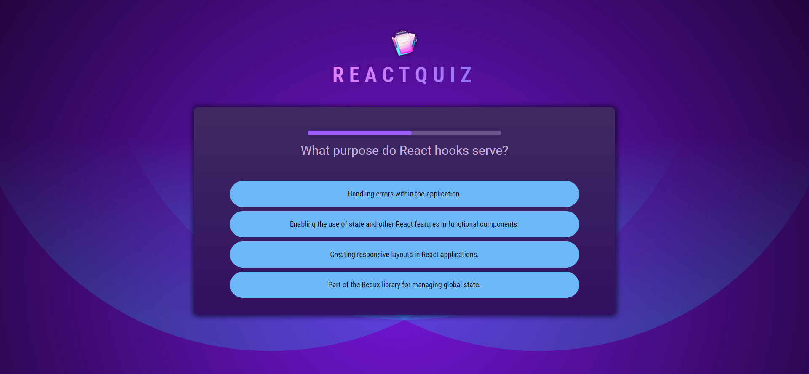

<h1 align="center">ReactQuiz</h1>
<p align="center">
    
 </p>

<p align="left">
  The "ReactQuiz" is a dynamic and engaging web application built with React.js. This application offers a variety of features, including a complete responsive design for seamless use on different devices, 
  a clean and intuitive user interface, and a timed quiz with a progress bar to track your progress. As you answer questions, the app instantly updates your score and also includes an automatic submission 
  feature when the timer runs out.
</p>


## Features

- Complete Responsive Website: This quiz app is designed to work seamlessly on various devices and screen sizes.
- Clean and Simple User Interface: A user-friendly design for an enjoyable quiz experience.
- Timer for Quiz: Each quiz question is timed, adding an element of challenge and excitement.
- Progress Bar: Keep track of your quiz progress in real-time.
- Score Card: Get a comprehensive scorecard with your quiz results.
- Auto-Submission: The quiz automatically submits when the time is up.

## 🛠️ Technologies:

- React
- JavaScript
- CSS3
- HTML5
- Vite

<h2>🚀 Live Demo</h2>

<p>Immerse yourself in its design and functionality with an interactive live demo — simply click the link to explore.</p>

**Live Preview** ➡️ <a href="https://srichandan-09.github.io/Quiz-App/" target="_blank" rel="noopener noreferrer">Demo</a>

<h2>🖼️ Project Screenshots</h2>

<p>Feel free to check out the screenshots of my website for a sneak peek into its captivating user interface.</p>

<p align="center">
  
</p>

<p align="center">
  
</p>

---

# ✨ How to Get Started

## Clone Project:

```bash

git clone https://github.com/Srichandan-09/Quiz-App.git

```

## Install the Dependencies:

```bash

npm install

```

or in short

```bash

npm i

```

## Launch:

```bash

npm run dev

```

## Author

<b>👤 Srichandan</b>

- LinkedIn - [@Srichandan](https://www.linkedin.com/in/srichandan09)
- Github: [@Srichandan-09](https://github.com/Srichandan-09)

Feel free to contact me with any questions or feedback!

## Show your support

Give a ⭐️ if you liked this project!
